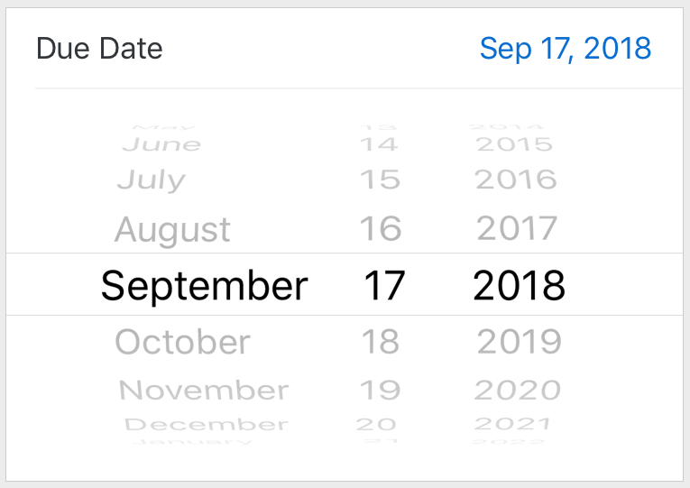

# Schedule Me - Design Document

- [Schedule Me - Design Document](#schedule-me---design-document)
  - [Introduction](#introduction)
    - [Program Summary](#program-summary)
    - [Inspiration](#inspiration)
      - [Sounds](#sounds)
      - [Look and style](#look-and-style)
    - [User Experience](#user-experience)
    - [Platform](#platform)
    - [Developments Software](#developments-software)
    - [Genre](#genre)
    - [Target Audience](#target-audience)
  - [Concept](#concept)
    - [Terminology](#terminology)
    - [Usage overview](#usage-overview)
  - [Art](#art)
    - [Theme](#theme)
    - [Design](#design)
    - [Audio](#audio)
      - [Sound Effects](#sound-effects)
  - [Program Experience](#program-experience)
    - [UI](#ui)
    - [Controls](#controls)
    - [Web-GUI](#web-gui)
      - [Keyboard](#keyboard)
  - [Development Timeline](#development-timeline)
    - [Main Product Timeline](#main-product-timeline)
    - [Pending Additional Features](#pending-additional-features)
  - [NOTES](#notes)
  - [RESOURCES](#resources)

## Introduction

### Program Summary

"Schedule Me" is my attempt to (re-)(cough-cough)organize my time with the help of a _simple_, _non-overwhelming_ and _intuitive_ schedule/calendar program.

### Inspiration

#### Sounds

Changing time: Apple and Samsung default clock/time application have a satisfying sound when changing the numbers of the time.

Notifications: TBD

#### Look and style

Apple does a good job using a **simple** ui for its time picker where the input and output (current set time) is _clear_, _clean_ and _intuitive_.  but it will be pixelated.

### User Experience

On the main page, only the current period, period and and edit button is shown to the user. 
Thus minimizing any complexity and distractions. The user must not feel any king of urgency or struggle.

### Platform

The program will be web-based with potential clients for pc and/or android.

### Developments Software

- Python for programming:
  - Flask as a framework

- JavaScript for programming some end-user components on web-gui.
- Aseprite for graphics and UI
- LMMS (https://lmms.io/) for all SFX and notifications

### Genre

- Time-keeping
- Web-Based

### Target Audience

Mainly **ME**. Although if anybody would be interested, the people in need of simple and robust time-keeping software.

## Concept

### Terminology

- period: An interval of time defining a task, action or anything that will take time.
- TP: Time Picker

### Usage overview

User has a simple **UI that shows the current period in the center screen**, starting time and ending time. Above the current period, there should be the _previous period if any_, under the current period should be the _next period if any_ and two buttons to edit the schedule and show the entire schedule.

User will have access to only 5 actions:

- View Current period -> Main Page/Initial window
- View My Table -> A page/window showing all periods and their details. The page will automatically go to the current period.
- Create Period -> A page/window that enables the user to create a period object.
- Delete Period -> Enables the user to get rid of specific period object.
- Edit Period -> Enables the user to change the selected period.

## Art

### Theme

The main idea is to keep it simple so a collection of up to 8 colors will be selected.

### Design

I would like to make it 8bit/pixelated style.

### Audio

#### Sound Effects

To add more "feel" for the program, sounds for different actions like changing the time or clicking on "add", "delete" etc. buttons will feedback to the user and will show a "polished" product.

## Program Experience

### UI

On top of the rest of the art and components written on UO part, I would like to let user choose a theme.

### Controls

### Web-GUI

The main tool to interact with the program will be the mouse.

#### Keyboard

As some people would like to use only the keyboard, I would like to implement a full keyboard interface for it.

- `ctrl` + `?` - shows the keyboard shortcuts
- `ctrl` + `p` - create new
- `ctrl` + `l` - list my table
- `ctrl` + `d` - show a popup with details about the current period
- `ctrl` + `shift` + `d` - shows a popup with todays periods for the end user to select and delete when pressing `enter` (`return`)

## Development Timeline

### Main Product Timeline

types: Other, Art, Audio, Coding
status: Not Started, In Progress, Finished

no | issue no.| Assignment | Type | Status | Finish By | Notes
---|----|------------|------|--------|-----------|------
1 || Design Document | Other | Finished | 2023-12-21 |
2 || Create a git and publish it | Other | Finished | 2023-12-19 |
3 || Create a changelog file | Other | Finished |
4 || Flask structure | Coding | Not Started | 2023-12-21 |
5 || User Object | Coding | Not Started| |
6 || Period Object implementation | Coding | Not Started | |

### Pending Additional Features

The list and its order are not definitive.

issue no. | Assignment | Type
---------|----------|---------
/ | CSS Framework | Art
/ | Button design | Art
/ | Time Picker design | Art
/ | Tick SFX for TP | Audio
/ | Add keyboard shortcuts | Coding

## NOTES

- Maybe find another word for period.. somebody will inevitable associate it with the wrong thing.

## RESOURCES

- https://docs.google.com/document/d/1Vl7BMvzUOhbunJrI_X1gUc6x-LAp3aaBiPwHUf27B70/edit
- https://blog.miguelgrinberg.com/post/flask-mega-tutorial-update-flask-2-0-and-more
- https://www.youtube.com/watch?v=DJMeQ0kJtco